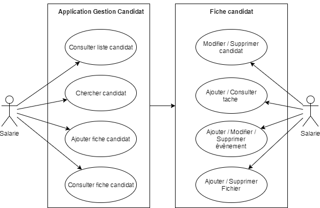

## Introduction

Voilà maintenant plusieurs années que je me passionne pour le métier de développeur informatique. Étant en reconversion professionnel, j'ai eu le temps, avant de commencer mes études, de me former seul sur certaine technologie. Le premier langage sur lequel je me suis perfectionner en tant qu’autodidacte a été le C#, et, ayant étudié plusieurs autres langages auparavant, j’ai pu me forger une opinion concrète des avantages que propose ce langage par rapport aux autres.

En entrant en formation chez Doranco, j’ai pu perfectionner ma compression de certains langages. Notamment le PHP, avec lequel j’ai réalisé un site e-commerce sans utiliser de framework associé, ce qui m'a permis d'obtenir mon diplôme de Développeur d'Application Multimédia en 2016. Cette expérience m’a conforté dans mon choix de langage pour mes futurs projets.

 

Par la suite, j'ai intégré une session de Concepteur Développeur Informatique dans laquelle j’étais en alternance chez Acial (Pure players du Test Logiciel). Parmis toutes les technologie que j'ai pu apprendre tout au long de la formation, il y en a, plus que d'autre, qui ont retenu tout particulièrement mon attention. Premièrement le C# que je manipulais déjà avant mon entrée en formation. Mais aussi Angular 4 qui est une des technologie que j'ai découvert durant la formation et qui m'a absolument satisfait. Même si malheureusement, je ne l’utiliserai pas dans ce projet. Cette dernière remarque est pour moi importante puisque je suis beaucoup moins compétent lorsqu’il s’agit d’imaginer une interface graphique. 

NodeJs est aussi une découverte très intéressante sur laquelle j'ai eu l'occasion de réaliser un service de traductions et de définitions intégré à une messagerie instantanée. 

Tout au long de mon alternance, j'ai été amené à pratiquer sur la technologie .NET avec le langage C# pour, principalement, la création d'un nouveau module de gestion des candidats à l'entreprise. Ce module a dû être ajouté à l'application déjà existante, qui a été réalisée en ASP classique avec le langage Visual Basic Script. Je me suis alors confronté à plusieurs problèmes de compatibilité entre les deux technologie afin de les faire cohabiter ensemble sur une même interface. En plus de ça, j'avais à ma charge le support de cette application. J'ai donc dû apprendre le Visual Basic Script, qui n'était pas enseigné durant la formation, afin de corriger les bug déjà présent.

J'ai eu la chance de choisir mes instruments de travail ainsi que les technologie de développement que j'allais utiliser pour la création de, ce que j'appellerais désormais, la "Gestion Candidats". Je devais par contre être en adéquation avec l'environnement Windows server, n'aillant que cela à ma disposition. Mon choix s'est porté naturellement vers[ ASP.NET](http://ASP.NET), et plus précisément les WebForm. Notons qu’avec le recule, je n'aurais pas fait exactement le même choix, je me serai plutôt dirigé vers[ ASP.NET](http://ASP.NET) MVC qui est bien plus utilisé aujourd'hui pour de nouveaux projet. Néanmoins, Webform offre une simplicité de prise en main et une fluidité sur la manipulation des éléments graphique déjà très aboutie. 

Pour héberger l'application en développement, j'ai à ma disposition un Microsoft Server 2012R2 couplé avec Microsoft SQL Server 2012 pour gérer les données. On notera que le serveur en production est légèrement différent puisqu'il est couplé avec un Microsoft SQL Server 2005, ce qui apporte des nuances au niveau de l'écriture SQL. 

L'application en ASP classique est, quant à elle, hébergée sur un Microsoft Server 2003. L’une de mes mission est aussi de porter l’application existante vers un Microsoft Server 2012R2, pour des raisons de sécurité et de stabilité. Ceci n’est évidemment pas le sujet de ce cahier des charges, mais je me permet de le préciser puisque cela m’a permis de comprendre plus en détail comment fonctionne un serveur Windows. Par exemple, le système de permission d’accès des utilisateurs est géré avec l’Active Directory du serveur Intranet à l’entreprise, cette méthode de connexion est très intéressante puisqu’elle permet de n’avoir qu’un seul compte utilisateur pour plusieurs actions. Par exemple, je dois me servir de cette base de données pour l’authentification, mais elle sert aussi à la connexion sur un poste se trouvant dans le réseau Intranet ainsi qu’à la boite mail jusqu’au système de messagerie instantané.

Enfin, la structure de la base de données SQL est imposée et n’est pas conforme à un développement orienté objet, ce qui est une difficultée supplémentaire lors des phases d’écriture du programme.

Je vais m’inspirer de ce travail pour réaliser mon projet. En retirant la contrainte de l’active directory. En démarrant avec un projet vierge, je retire aussi la contrainte de la cohabitation avec toutes autres modules de quelconques natures, et je partirai d’une structure de base de données orientée objet. Je gagnerai avec cela une plus grande libertée sur mes choix de développement.

Tout au long de ce cahier des charges, je tenterais de vous expliquer en détail la réponse que j'ai fournis à la demande de départ. Je parlerais des problèmes que j'ai rencontré en apportant des solutions et je passerais en revue les différentes étapes de conception.

## Problématique

Acial est une PME ayant connu une rapide évolution au cours des deux dernières années. En effet, la société a réussi à doubler son nombre de salariés au cours de l’année 2016, passant d’une centaine d’employées à plus de deux-cents. Cette société n’a jamais connu une expansion aussi rapide durant sa carrière et en connaîtra plusieurs autres dans les années à venir. Les outils utilisés par l’entreprise n’ont pas évolué depuis maintenant plus de dix ans et, jusqu’à aujourd’hui, le besoin d’en changer ne se faisait pas ressentir.

Néanmoins, leurs utilisations deviennent de plus en plus difficil à cause de leur expansion récente. Le bureau de recrutement a à sa disposition un serveur Exchange couplé avec le service de mail Outlook. Une interface Exchange, créée par les utilisateurs eux même, permet de remplir une fiche d’un potentiel candidat à l’entreprise puis est sauvegardée dans la base de données chiffrées de microsoft. La base de données est ensuite consultable depuis l’application Outlook ou exchange. 

La technologie apporte certain avantages non négligeable. Son utilisation est relativement simple et un développeur n’a pas besoin d’intervenir sur la création d’un modul Exchange en raison de sa simplicité. Par contre, les contraintes sont multiples et s'avère de plus en plus gênante avec le temps. 

La base de données n’est pas exploitable en dehors de Exchange ou Outlook, l’interface est limitée dans sa personnalisation, les documents épinglé sur la fiche ne sont pas récupérable autrement que par son téléchargent individuel et pour finir, le système de recherche n’est pas, lui non plus, personnalisable et ne permet pas les recherches dans les documents.

C’est pour répondre à tous ces points que j’interviens pour apporter des solutions pertinentes. Avec la création d’une application web, j’aurais l’opportunité d’y répondre et en plus d’apporter des nouveautées comme un système de favoris intégré à l’application. La création d’une base de données relationnel avec SQL Server me permettra de remplacer la base Exchange. 

Pour cela, je vais devoir importer la base Exchange dans une table SQL conçue spécialement pour la réception des données. L’interface utilisateur sera conçue avec les langages du web et avec la boîte à outils ASP proposée par Visual Studio 2017, qui offre une palette de fonctionnalitées tel que les "GridView" pour générer des tableaux en fonction d’une requête SQL, ou la famille des “FieldValidator” avec lesquelles on peut faire des vérifications sur les entrées utilisateurs dans le but d’éviter les erreurs humaine. Les fichiers seront enregistrés dans un dossier sécurisé sur le réseau intranet, ce qui va me permettre de les réutiliser dans d’autres context en plus de pouvoir lire les documents pour perfectionner ma recherche. 

Pour finir, je ferais mon propre système de recherche de candidat en me basant sur l’attente qu’un utilisateur a sur la volonté de changement par rapport au système Exchange actuel.

## Cible

Mon application aura pour but d’en remplacer une autre. Avant de la commencer, je dois comprendre ce qu’était l’application en profondeur. Les avantages qu’elle avait pour les garder et les perfectionner, ainsi que ses inconvénients pour les corriger ou les supprimer.

J’ai alors eu une présentation sommaire de ce qui existait, puis j’ai procédé à une enquête auprès des utilisateur tout au long de mon développement pour ne pas reproduire les erreurs existantes. 

Fort heureusement pour moi, tous les utilisateurs de mon application son dans la même entreprise que la mienne. C’est pour le service de recrutement et des responsables hiérarchique que le besoin a été énoncé. Je travaillerai en étroite collaboration avec eux tout au long de mon projet.

## Exigences

Ergonomiquement, l’application devra être ISO conforme avec celle existante et son comportement devra être reproduit à l’identique. Ceci pour ne pas être obligé de former toute l’équipe sur un nouvel environnement de travail. 

Un utilisateur doit avoir la possibilité de:

* créer un nouveau candidat en renseignant une fiche d’informations,

* modifier un candidat existant et visible pour lui,

* supprimer un candidat uniquement s’il a le droit associé,

* envoyer des tâches aux autres utilisateurs,

* consulter sa liste de tâches,

* stocker des pièces jointes par candidat,

* répertorier les événements par candidat,

* rechercher par mots clé un candidat,

* consulter les candidats avec des listes définis,

* ajouter un candidat à sa liste de favoris,

* consulter sa liste de favoris.

Voici les principales exigences que l’application devra fournir. Je ne ferai pas la liste ici de toutes les exigences. Dans les prochaines versions, on devra avoir la possibilité de créer un nouveau contrat à partir d’une fiche candidat pour ensuite créer un nouveau consultant.

## Rôles

On peut trouver quatre rangs principaux dans la hiérarchie de la société. Dans l’application Gestion Candidat, les rôles serviront principalement à filtrer les fiches de liste des candidats, comme suit : 

* un consultant ne peut voir que les candidats pour un poste de *consultant*,

* un commercial a les même droits qu’un consultant,

* un responsable de département peut voir les *commerciaux* et les *consultants*,

* un associé peut voir tout le monde (consultants, commerciaux, responsable, associé)

Le rang associé lui apporte aussi le privilège de supprimer une fiche d’un candidat

	

## Stories

Pour répondre à ses exigence j’ai réalisé des profils différent pour créer mes "stories". Les utilisateurs ont un trigramme pour s’identifier, je procéderai donc ainsi : 

* CAD, associé 

* GGH, commercial

* DGM, commercial

* HAM, responsable

* PTT, responsable

* JML, consultant.

Grâce à cette liste, toutes les "stories" pourront être réalisées. Nous verrons dans un autre chapitre l’avancement du projet en suivant la méthode Agile.

## Apparence

L’interface devra s’intégrer parfaitement au reste de l’application existante, je doit donc respecter la forme des éléments ainsi que leurs couleurs associées.

Je me permettrai, malgré cette contrainte, d’apporter du style aux éléments qui n’en ont pas encore. J’utiliserai aussi la librairie bootstrap pour organiser proprement mon interface. 

## Technologies

Pour la bonne réalisation de mon projet, et après avoir pesé le pour et le contre, j’ai réalisé une liste de tous les produits qui me serviront durant toutes les étapes de création..

### Visual Studio 2017 Community

L’outils qui me suivra tout au long de mon projet. Il me servira à produire les diagrammes,  gérer la base SQL Server, gérer mon serveur GitHub, réaliser mais campagnes de test unitaires, mon interface utilisateur et enfin à écrire mon programme.

### ASP.NET MVC 5

Microsoft propose, pour faire des applications web, ASP.NET qui est une branche du .NET framework. Aussi, j’ai opté pour le patron de conception MVC pour que l’application soit maintenable plus longtemps puisque c’est devenu standard dans la création d’applications.

### Langages

Dans la conception du serveur, et alors que j’avais le choix entre plusieurs langages, j’ai choisi d’utiliser C#. Pour plusieurs raisons évidentes, mais surtout pour rendre le projet maintenable si un autre développeur reprend le projet après moi.

Pour l’interface homme-machine, j’ai à ma disposition la librairie ASP proposé par le framework  apportant une multitude d’outils qui, en plus d’être agréable à utiliser, formate le résultat aux normes du web standard au moment de la compilation. De plus, il est très aisé d’ajouter des fonctionnalités créées par la communauté et de les intégrer au projet. Pour donner un exemple, je citerai AjaxControlToolkit qui apporte un moyen d’intégrer un calendrier moderne et pratique à l’évènement de notre choix.

Le style du site sera géré avec CSS3, je n’utiliserais pas SASS ou Less pour démarrer ce projet puisqu’une grosse partie du travail a déjà été fait. j’utiliserais SASS pour une prochaine évolution.

Je terminerai par le langage SQL que j’utiliserai pour faire la création de la base de données, les vues, les procédures stockées. Dans le programme, j’utiliserai LinQ pour faire mes requêtes.

### Trello

J’ai choisi pour mon organisation Trello. Il me suivra tout au long de mon projet pour que je ne sois jamais perdu dans mon avancement. Je pourrais consulter mon tableau en ligne à partir d’une connexion internet et d’un compte dédié au projet. Une présentation du tableau détaillées se fera dans une prochaine partie.

### Git

C’est, pour l’instant, le seul outil de versionning que je connaisse, ce qui m’a naturellement aidé à faire mon choix. Un serveur GitHub pour retrouver mon projet sera aussi mis en place. Je présenterai mon architecture Git dans un prochain chapitre.

### IIS 8.5 (Internet Information Service)

Ce logiciel est un serveur web capable, entre autre, de prendre en charge les applications ASP, les services SMTP et FTP. On est aussi capable, en l’utilisant, de paramétrer le fichier Web.config de mon application via une interface d’administration.

### Windows Server 2012 R2

Le choix de la version du serveur a été prise par le responsable du réseau informatique. D’après lui, cette version est la plus avantageuse en comparaison de tout ce qu’il y a sur le marché Microsoft. 

### SQL Server Management Studio 2017

Le serveur de base de données est géré par le logiciel de Microsoft. Il offre de nombreuses fonctionnalités et est très bien intégré à l’environnement sur lequel je travaille. On peut, par exemple, se connecter à une base de données en spécifiant l’ID que l’on a dans l’Active Directory de l’Intranet, à la condition d’avoir les droits.

## Conception

### Diagrammes UML

Dans ce chapitre nous allons voir les différents diagrammes UML que j’ai produit pour comprendre l’application que j’ai réalisé. Prenons en compte que tous les diagrammes ont été pensé et conçu après que mon application ait été réalisée et mise en production. C’est évidemment, j’en suis bien conscient, le mauvais moment pour produire un diagramme UML. Malgré cela, il est très important de les réaliser dans le cas où l’on voudrait, pour une quelconque raison, refaire l’application sur une autre technologie, ou présenter la logique du logiciel plus simplement à tout type de personnes.

Je commencerai par vous présenter le diagramme de cas d’utilisation pour comprendre plus en détails ce que fait l’application, puis je passerai sur tous les autres diagrammes utile à la compréhension de chaque couche de conception.

### Diagramme de cas d’utilisation

## Test-Driven Development

Il existe plusieurs façons de s’organiser pour développer des fonctionnalitées de son application.Beaucoup de développeurs ont optés pour une solution sur et rapide qui veut que l’on écrive les tests de développement avant le développement.

Dans mon cas, j’utiliserai cette méthode pour formater la requête de l’utilisateur lorsqu’il fait une recherche. La "recherche candidat" doit répondre à des exigences particulières de recherche. Je l’utiliserai aussi pour d’autres fonctionnalitées nécessitant cette procédure.

### Exigences (recherche candidat)

La base de données existante comporte déjà plus de 8000 fiches représentant de potentiels candidats aux différents postes de l’entreprise. C’est pour cela que la recherche doit répondre aux attentes suivantes.

La recherche doit être capable de faire une recherche avec :

* un mot d’au moins deux lettres,

* deux mots et plus, séparés par un espace,

* deux groupes de mots séparés par un signe plus (+),

* deux groupes de mots séparés par un signe moins (-),

* trois groupes de mots séparés par un signe plus (+) puis un signe moins (-),

* la requête de recherche ne doit pas commencer par un signe plus ou moins.

Le formatage doit répondre ce comportement :

* rendre les mots insensible à la casse,

* retirer les diacritiques,

* interpréter un espace comme l'opérateur OR,

* interpréter le signe plus (+) comme l'opérateur AND,

* interpréter le signe plus (-) comme une exclusion,

* la recherche doit se faire dans tous les champs éditables de la fiche,

* la recherche doit opérer uniquement sur le tableau affiché,

* la requête doit être encodée au format URL pour les symboles.

### Exemple

Un exemple aidera à la compréhension des exigences. Je vais définir un tableaux non représentatifs des données que l’on pourra trouver en production mais qui illustrera plus clairement les attentes.

##### *Base de *données

<table>
  <tr>
    <td>Id</td>
    <td>Text</td>
  </tr>
  <tr>
    <td>1</td>
    <td>JAVA</td>
  </tr>
  <tr>
    <td>2</td>
    <td>JAVA C#</td>
  </tr>
  <tr>
    <td>3</td>
    <td>C++, Python,  Visual Adélia</td>
  </tr>
  <tr>
    <td>4</td>
    <td>C#, VBScript, PowerShell, SQL</td>
  </tr>
  <tr>
    <td>5</td>
    <td>Transact-SQL Scala C#</td>
  </tr>
</table>

##### Cas de tests

Je présenterai ici les entrées après formatage, puis les sorties en me servant des Id.

<table>
  <tr>
    <td>Entrées</td>
    <td>Sorties</td>
  </tr>
  <tr>
    <td>java</td>
    <td>1 2</td>
  </tr>
  <tr>
    <td>java c#</td>
    <td>1 2 4 5</td>
  </tr>
  <tr>
    <td>java c# + sql</td>
    <td>4 5</td>
  </tr>
  <tr>
    <td>adelia sql - scala</td>
    <td>3 4</td>
  </tr>
  <tr>
    <td>sql java py scala + c# - shell</td>
    <td>2 5</td>
  </tr>
</table>

	

Pour que ma fonction de recherche soit terminée, elle devra répondre à ces cas de tests. Je les utiliserai en plus de tests plus approfondis.

## Trello

Voici un aperçue de l’organisation sur Trello pendant la phase de développement. Après avoir préparer les "stories" et après avoir fait la liste des tâches pour la mise en place de l'environnement de développement. Cet outil m’a beaucoup aidé à suivre le principe de la méthode Agile comme vous pouvez le voir dans le tableau ci-dessous. 

*Tableau Trello*

## Architecture GIT

Git est un outils de versionning parmis plusieurs outils du même type. Pour la création de l’application, aucun temps de recherche m’a été accordé pour une comparaison poussée entre ces différents outils. Je suis alors obligé d’utiliser Git pour gérer les versions de mon application puisque c’est le seul que je connaisse assez.

Pour travailler avec Git et son système de branche, j’ai dû faire des recherches de bonne pratiques à son l’utilisation. Une architecture logique me permettra de ne pas me perdre entre les phase de développement et les phases de test. En utilisant le schéma ci-dessous, je suis sur de garder une trace logique de toutes mes actions.

*Architecture Git*

Amélioration d’une version stable dans la branche DEV. Correction rapide de la version stable dans la branche PATCH. Dès qu’une fonctionnalité est terminé et testée, elle est envoyée en production, c’est-à-dire dans la branche MASTER.

## Conclusion

## Remerciement

